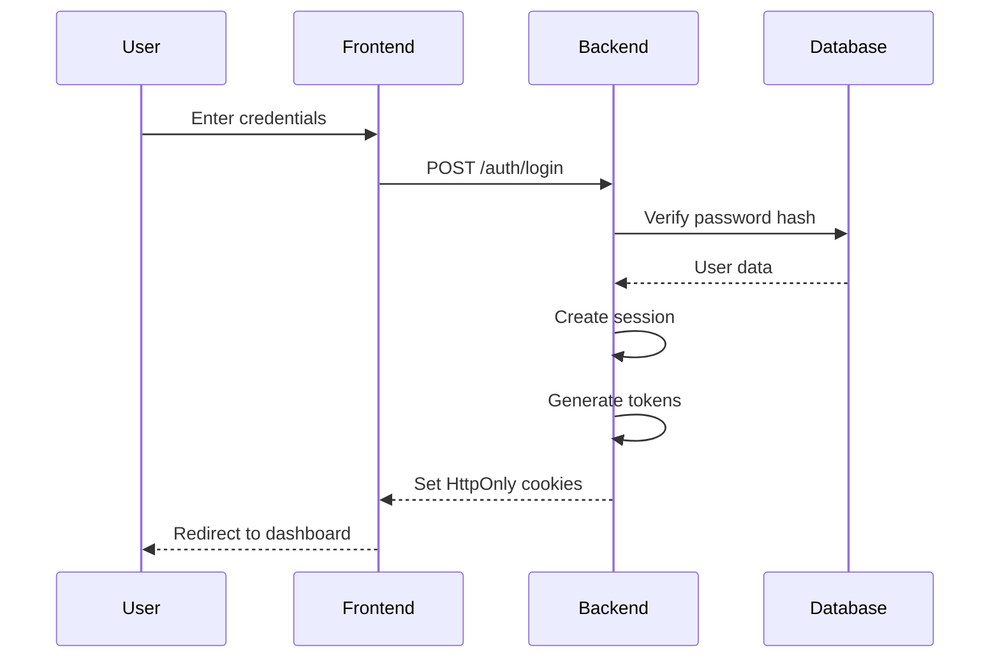
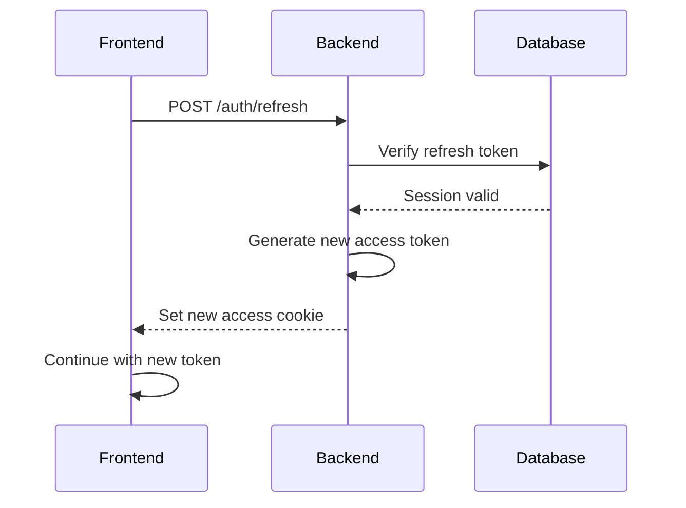
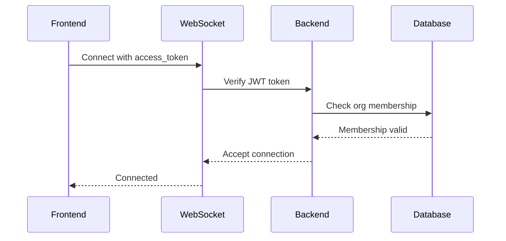

# Authentication & Cross-Device Sync Documentation

This document explains the authentication system and cross-device synchronization implementation for PermitTracker.

## Overview

The authentication system provides:
- User accounts with email-as-username support
- Secure password hashing with Argon2 (bcrypt fallback)
- JWT access tokens + opaque refresh tokens
- HttpOnly cookies for web/PWA security
- Multi-device session management
- Organization-based access control (RBAC)
- WebSocket authentication for real-time sync

## Authentication Flow

### 1. User Registration/Login



### 2. Token Refresh Flow



### 3. WebSocket Authentication



## Database Schema

### Users Table
```sql
CREATE TABLE users (
    id UUID PRIMARY KEY DEFAULT gen_random_uuid(),
    email VARCHAR(255) UNIQUE NOT NULL,
    username VARCHAR(100) UNIQUE NULL,
    password_hash TEXT NOT NULL,
    is_active BOOLEAN DEFAULT TRUE,
    created_at TIMESTAMPTZ DEFAULT NOW(),
    updated_at TIMESTAMPTZ DEFAULT NOW()
);
```

### Organizations Table
```sql
CREATE TABLE orgs (
    id VARCHAR(50) PRIMARY KEY,
    name VARCHAR(200) NOT NULL,
    created_at TIMESTAMPTZ DEFAULT NOW(),
    updated_at TIMESTAMPTZ DEFAULT NOW()
);
```

### Organization Memberships Table
```sql
CREATE TABLE org_memberships (
    id UUID PRIMARY KEY DEFAULT gen_random_uuid(),
    user_id UUID REFERENCES users(id) ON DELETE CASCADE,
    org_id VARCHAR(50) REFERENCES orgs(id) ON DELETE CASCADE,
    role VARCHAR(20) CHECK (role IN ('owner', 'admin', 'member')),
    created_at TIMESTAMPTZ DEFAULT NOW(),
    updated_at TIMESTAMPTZ DEFAULT NOW(),
    UNIQUE(user_id, org_id)
);
```

### Sessions Table
```sql
CREATE TABLE sessions (
    id UUID PRIMARY KEY DEFAULT gen_random_uuid(),
    user_id UUID REFERENCES users(id) ON DELETE CASCADE,
    refresh_token_hash TEXT NOT NULL,
    user_agent TEXT,
    ip_address INET,
    created_at TIMESTAMPTZ DEFAULT NOW(),
    expires_at TIMESTAMPTZ NOT NULL,
    revoked_at TIMESTAMPTZ NULL
);
```

### Password Resets Table
```sql
CREATE TABLE password_resets (
    id UUID PRIMARY KEY DEFAULT gen_random_uuid(),
    user_id UUID REFERENCES users(id) ON DELETE CASCADE,
    token_hash TEXT NOT NULL,
    expires_at TIMESTAMPTZ NOT NULL,
    used_at TIMESTAMPTZ NULL,
    created_at TIMESTAMPTZ DEFAULT NOW()
);
```

## API Endpoints

### Authentication Endpoints

| Method | Endpoint | Description | Auth Required |
|--------|----------|-------------|---------------|
| POST | `/auth/register` | Register new user | No |
| POST | `/auth/login` | Login user | No |
| POST | `/auth/logout` | Logout current session | Yes |
| POST | `/auth/logout-all` | Logout all sessions | Yes |
| POST | `/auth/refresh` | Refresh access token | No (refresh token) |
| GET | `/auth/me` | Get current user info | Yes |
| GET | `/auth/sessions` | Get user sessions | Yes |
| DELETE | `/auth/sessions/{id}` | Revoke specific session | Yes |
| POST | `/auth/request-password-reset` | Request password reset | No |
| POST | `/auth/reset-password` | Reset password | No (reset token) |

### WebSocket Endpoint

| Endpoint | Description | Auth Required |
|----------|-------------|---------------|
| `/ws/events?org_id={org_id}&access_token={token}` | Real-time updates | Yes |

## Security Features

### Password Security
- **Argon2** primary hashing algorithm
- **bcrypt** fallback for compatibility
- Minimum 8 character password requirement
- Password confirmation validation

### Session Security
- **HttpOnly cookies** prevent XSS attacks
- **SameSite=Lax** prevents CSRF attacks
- **Secure flag** for HTTPS (configurable)
- **Token rotation** on refresh
- **Session limits** (5 devices max, configurable)

### Rate Limiting
- Login attempts: 5 per 5 minutes per IP
- Registration attempts: 5 per 5 minutes per IP
- Password reset: 5 per 5 minutes per IP

### WebSocket Security
- JWT token verification at handshake
- Organization membership validation
- Connection limits per organization
- Graceful error handling with specific codes

## Cross-Device Sync

### Real-time Synchronization
1. **WebSocket Connection**: Authenticated connection per organization
2. **Event Broadcasting**: Org-scoped permit updates
3. **Client-side Caching**: IndexedDB for offline support
4. **Automatic Reconnection**: Exponential backoff on connection loss

### Session Management
1. **Multi-device Support**: Up to 5 concurrent sessions
2. **Session Tracking**: User agent, IP address, creation time
3. **Session Revocation**: Individual or bulk session termination
4. **Automatic Cleanup**: Expired session removal

## iOS PWA Considerations

### Cookie Support
- **SameSite=Lax** works in iOS 17+ PWAs
- **HttpOnly cookies** supported in PWA context
- **Secure flag** automatically disabled for localhost development

### WebSocket Considerations
- **Background refresh** handles iOS sleep/wake cycles
- **Exponential backoff** for reconnection
- **Token refresh** before WebSocket reconnection

### PWA Manifest
```json
{
  "name": "PermitTracker",
  "short_name": "PermitTracker",
  "start_url": "/dashboard",
  "display": "standalone",
  "theme_color": "#2563eb",
  "background_color": "#ffffff"
}
```

## Configuration

### Environment Variables

```bash
# Authentication
AUTH_JWT_SECRET=your-secret-key
AUTH_ACCESS_TTL=15m
AUTH_REFRESH_TTL=30d
AUTH_COOKIE_DOMAIN=yourdomain.com
AUTH_COOKIE_SECURE=true
MAX_SESSIONS_PER_USER=5

# Feature Flags
FEATURE_TOTP_2FA=false
FEATURE_WEBAUTHN=false
```

### Development vs Production

| Setting | Development | Production |
|---------|-------------|------------|
| AUTH_COOKIE_SECURE | false | true |
| AUTH_COOKIE_DOMAIN | localhost | yourdomain.com |
| AUTH_JWT_SECRET | dev-secret | strong-random-secret |

## Error Handling

### HTTP Status Codes
- **401 Unauthorized**: Invalid or expired token
- **403 Forbidden**: Insufficient permissions
- **429 Too Many Requests**: Rate limit exceeded
- **400 Bad Request**: Invalid request data

### WebSocket Close Codes
- **4001**: Authentication required
- **4003**: Access denied to organization
- **4000**: General authentication failure

## Testing

### Unit Tests
- Password hashing verification
- JWT token generation/validation
- Session management
- Rate limiting

### Integration Tests
- Authentication flow
- Token refresh
- WebSocket authentication
- Session limits
- RBAC enforcement

### Manual Testing Checklist
- [ ] Register new user
- [ ] Login with valid credentials
- [ ] Login with invalid credentials
- [ ] Token refresh before expiry
- [ ] WebSocket connection with valid token
- [ ] WebSocket rejection with invalid token
- [ ] Session limit enforcement
- [ ] Logout from all devices
- [ ] Password reset flow
- [ ] iOS PWA cookie behavior

## Deployment Checklist

### Pre-deployment
- [ ] Generate strong AUTH_JWT_SECRET
- [ ] Set production AUTH_COOKIE_DOMAIN
- [ ] Enable AUTH_COOKIE_SECURE
- [ ] Run database migrations
- [ ] Test authentication flow

### Post-deployment
- [ ] Verify HTTPS certificate
- [ ] Test cookie behavior
- [ ] Verify WebSocket authentication
- [ ] Test cross-device sync
- [ ] Monitor authentication logs

## Troubleshooting

### Common Issues

1. **WebSocket Connection Fails**
   - Check access token validity
   - Verify organization membership
   - Check CORS settings

2. **Cookies Not Set**
   - Verify domain configuration
   - Check HTTPS certificate
   - Test in incognito mode

3. **Token Refresh Fails**
   - Check refresh token validity
   - Verify session not revoked
   - Check token expiration

4. **iOS PWA Issues**
   - Verify SameSite=Lax
   - Test background refresh
   - Check manifest configuration

### Debug Mode
Enable debug logging by setting:
```bash
LOG_LEVEL=DEBUG
```

This will log authentication events, token operations, and WebSocket connections.
